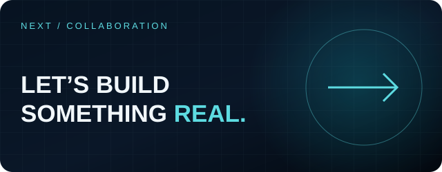

<!-- LALITH TEJA KARNATI · GitHub profile -->

 

<a href="https://www.linkedin.com/in/lalith-teja-karnati-a59473270"><strong>LINKEDIN ↗</strong></a>
&nbsp;&nbsp;&nbsp;·&nbsp;&nbsp;&nbsp;
<a href="mailto:lalithteja21@gmail.com"><strong>EMAIL ↗</strong></a>
&nbsp;&nbsp;&nbsp;·&nbsp;&nbsp;&nbsp;
<a href="https://github.com/lalithtejakarnati?tab=repositories"><strong>ALL REPOSITORIES ↗</strong></a>

  

HYDERABAD, INDIA &nbsp; / &nbsp; COMPUTER SCIENCE ENGINEERING · 2026

 

### 01 / PROFILE

I build software at the intersection of **artificial intelligence, computer vision, and practical engineering**. My work spans machine learning applications, image understanding, developer tools, and full-stack problem solving—with an emphasis on turning ideas into usable systems.

 

### 02 / SELECTED ENGINEERING WORK

Nine public projects. One consistent presentation. Select any card to explore its source code.

<table>
<tr>
<td width="50%" valign="top">

 <strong>ALPHAFORGE</strong> 
Algorithmic trading · Python · Risk systems  
Production-oriented trading platform with paper trading, strategy validation, execution lifecycle, risk controls, and observability.
  <a href="https://github.com/lalithtejakarnati/ALPHAFORGE">EXPLORE REPOSITORY ↗</a>
</td>
<td width="50%" valign="top">

 <strong>CROP AI</strong> 
Machine learning · Agriculture · Python  
Agricultural intelligence project for crop disease identification and fertilizer prediction.
  <a href="https://github.com/lalithtejakarnati/Crop-Disease-Identification-and-Fertilizer-Prediction">EXPLORE REPOSITORY ↗</a>
</td>
</tr>
<tr>
<td width="50%" valign="top">

 <strong>FARMERSCONNECT</strong> 
Web development · Agriculture · HTML  
A web platform exploring accessible digital experiences for the agricultural domain.
  <a href="https://github.com/lalithtejakarnati/FarmersConnect">EXPLORE REPOSITORY ↗</a>
</td>
<td width="50%" valign="top">

 <strong>REAL-TIME IMAGE DEHAZING</strong> 
Computer vision · CNN · Image restoration  
Image enhancement research combining convolutional neural networks and Dark Channel Prior techniques.
  <a href="https://github.com/lalithtejakarnati/A-Realtime-Image-Dehazing-using-CNN-and-DCP">EXPLORE REPOSITORY ↗</a>
</td>
</tr>
<tr>
<td width="50%" valign="top">

 <strong>BLOOD CELL CLASSIFICATION</strong> 
Deep learning · Medical imaging · CNN  
Microscopic blood cell image classification using machine learning and deep learning techniques.
  <a href="https://github.com/lalithtejakarnati/Classification-of-microscopic-blood-cells-using-Machine-Learning">EXPLORE REPOSITORY ↗</a>
</td>
<td width="50%" valign="top">

 <strong>RESUME PARSER</strong> 
NLP · Information extraction · Python  
Natural language processing for extracting structured information from resumes.
  <a href="https://github.com/lalithtejakarnati/Resume-Parser">EXPLORE REPOSITORY ↗</a>
</td>
</tr>
<tr>
<td width="50%" valign="top">

 <strong>IMDB GENRE PREDICTION</strong> 
NLP · Machine learning · Text classification  
Exploring movie genre prediction through natural language processing and machine learning.
  <a href="https://github.com/lalithtejakarnati/IMDB-Movie-Genre-Prediction">EXPLORE REPOSITORY ↗</a>
</td>
<td width="50%" valign="top">

 <strong>UNIT CONVERTER / ANDROID</strong> 
Android · Java · XML  
Native Android utility application for everyday unit conversions.
  <a href="https://github.com/lalithtejakarnati/UnitConverter-Android">EXPLORE REPOSITORY ↗</a>
</td>
</tr>
<tr>
<td width="50%" valign="top">

 <strong>CALCULATOR / ANDROID</strong> 
Android · Java · XML  
A native Android calculator application focused on core UI and application development.
  <a href="https://github.com/lalithtejakarnati/Calculator-Android">EXPLORE REPOSITORY ↗</a>
</td>
<td width="50%" valign="top">

 <strong>OPEN TO COLLABORATION</strong> 
Engineering · Research · Product ideas  
Interested in thoughtful software, applied AI, and collaborations that solve real problems.
  <a href="mailto:lalithteja21@gmail.com">START A CONVERSATION ↗</a>
</td>
</tr>
</table>

 

### 03 / CAPABILITIES

**AI & DATA** &nbsp; Python · PyTorch · TensorFlow · scikit-learn · NLP · Computer Vision · OpenCV

**ENGINEERING** &nbsp; Java · SQL · Git · Android · Web Development · Software Design

 

<strong>MORE / ABOUT MY APPROACH</strong> &nbsp; ↗

 
I am a Computer Science Engineering graduate (2026) based in Hyderabad. I am especially interested in building reliable intelligent systems, studying how models behave in real applications, and improving the engineering around them. My portfolio reflects practical exploration across AI, computer vision, web applications, and Android development.

 

<a href="mailto:lalithteja21@gmail.com">EMAIL</a> &nbsp; · &nbsp; <a href="https://www.linkedin.com/in/lalith-teja-karnati-a59473270">LINKEDIN</a> &nbsp; · &nbsp; <a href="https://github.com/lalithtejakarnati">GITHUB</a>

