


 

**B.Tech Computer Science Engineering · Hyderabad, India**

[**LinkedIn ↗**](https://www.linkedin.com/in/lalith-teja-karnati-a59473270/) &nbsp; · &nbsp; [**Email ↗**](mailto:lalithteja713@gmail.com) &nbsp; · &nbsp; [**Repositories ↗**](https://github.com/lalithtejakarnati?tab=repositories)

 

### 01 / ABOUT ME

I'm **Lalith Teja Karnati**, a Computer Science Engineering graduate working across **software engineering, artificial intelligence, and machine learning**. My projects cover computer vision, deep learning, natural language processing, agricultural prediction, and application development.

I enjoy translating technical ideas into useful software—from CNN-based image restoration and medical image classification to structured document extraction and trading-system engineering. I'm interested in **software engineering and applied AI opportunities**, collaborative development, and solving practical problems.

<!-- ========================================================= -->
<!-- 02 / TECHNICAL EXPERTISE & CORE COMPETENCIES              -->
<!-- ========================================================= -->

<h2>02 / TECHNICAL EXPERTISE & CORE COMPETENCIES</h2>

 

<h3>◈ Programming Languages</h3>

  
  &nbsp;&nbsp;&nbsp;
  
  &nbsp;&nbsp;&nbsp;
  
  &nbsp;&nbsp;&nbsp;
  
  &nbsp;&nbsp;&nbsp;
  

  PYTHON &nbsp; • &nbsp; JAVA &nbsp; • &nbsp; SQL &nbsp; • &nbsp; HTML5 &nbsp; • &nbsp; CSS3

 

<h3>◈ Artificial Intelligence & Machine Learning</h3>

  
  &nbsp;&nbsp;&nbsp;
  
  &nbsp;&nbsp;&nbsp;
  
  &nbsp;&nbsp;&nbsp;
  

  PYTORCH &nbsp; • &nbsp; TENSORFLOW &nbsp; • &nbsp; SCIKIT-LEARN &nbsp; • &nbsp; KERAS

 

<h3>◈ Computer Vision & Image Processing</h3>

  
  &nbsp;&nbsp;&nbsp;
  
  &nbsp;&nbsp;&nbsp;
  

  OPENCV &nbsp; • &nbsp; NUMPY &nbsp; • &nbsp; PILLOW

 

<h3>◈ Data Science & Analytics</h3>

  
  &nbsp;&nbsp;&nbsp;
  
  &nbsp;&nbsp;&nbsp;
  

  PANDAS &nbsp; • &nbsp; NUMPY &nbsp; • &nbsp; JUPYTER NOTEBOOK

 

<h3>◈ Databases</h3>

  
  &nbsp;&nbsp;&nbsp;
  

  MYSQL &nbsp; • &nbsp; SQLITE

 

<h3>◈ Development Tools & Platforms</h3>

  
  &nbsp;&nbsp;&nbsp;
  
  &nbsp;&nbsp;&nbsp;
  
  &nbsp;&nbsp;&nbsp;
  
  &nbsp;&nbsp;&nbsp;
  

  GIT &nbsp; • &nbsp; GITHUB &nbsp; • &nbsp; ANDROID STUDIO &nbsp; • &nbsp; VS CODE &nbsp; • &nbsp; LINUX

 

---

### 03 / SELECTED PROJECTS

*Nine public projects. Each visual card opens the source repository.*

<table>
<tr>
<td width="50%" valign="top"><a href="https://github.com/lalithtejakarnati/ALPHAFORGE">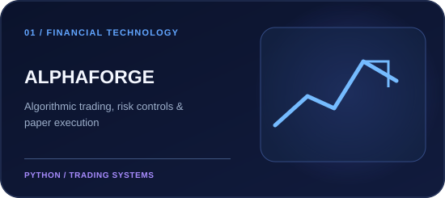</a></td>
<td width="50%" valign="top"><a href="https://github.com/lalithtejakarnati/Crop-Disease-Identification-and-Fertilizer-Prediction">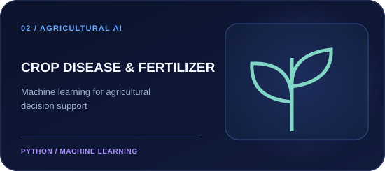</a></td>
</tr>
<tr>
<td width="50%" valign="top"><a href="https://github.com/lalithtejakarnati/FarmersConnect">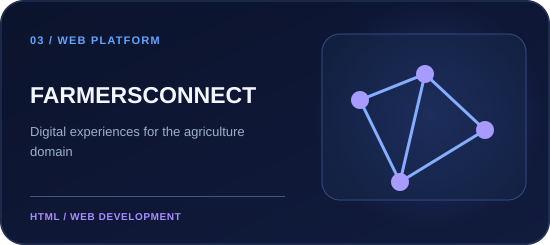</a></td>
<td width="50%" valign="top"><a href="https://github.com/lalithtejakarnati/A-Realtime-Image-Dehazing-using-CNN-and-DCP">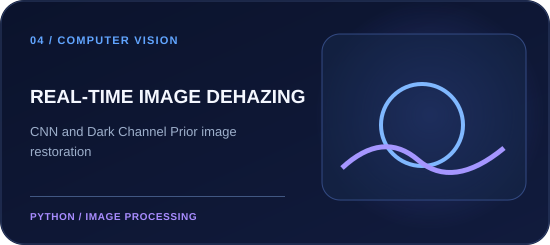</a></td>
</tr>
<tr>
<td width="50%" valign="top"><a href="https://github.com/lalithtejakarnati/Classification-of-microscopic-blood-cells-using-Machine-Learning">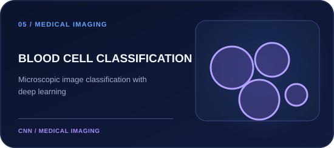</a></td>
<td width="50%" valign="top"><a href="https://github.com/lalithtejakarnati/Resume-Parser">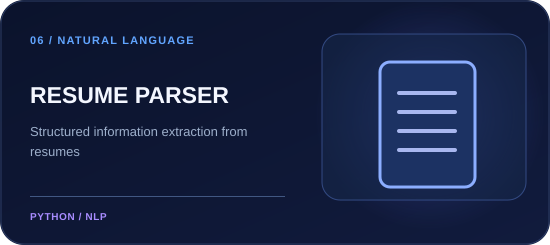</a></td>
</tr>
<tr>
<td width="50%" valign="top"><a href="https://github.com/lalithtejakarnati/IMDB-Movie-Genre-Prediction">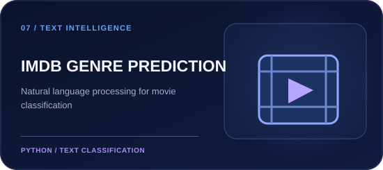</a></td>
<td width="50%" valign="top"><a href="https://github.com/lalithtejakarnati/UnitConverter-Android">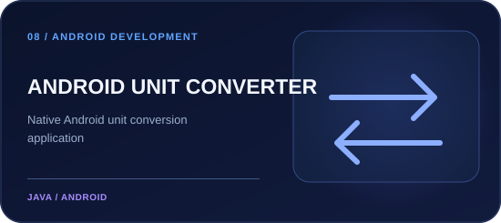</a></td>
</tr>
<tr>
<td width="50%" valign="top"><a href="https://github.com/lalithtejakarnati/Calculator-Android">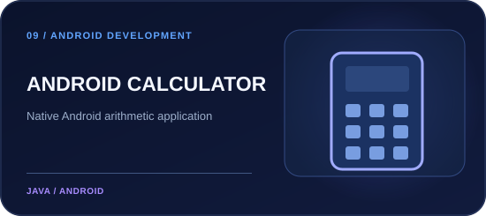</a></td>
<td width="50%" valign="top" align="center">  <strong>EXPLORE THE PORTFOLIO</strong>  AI · Computer Vision · Android · Web  <a href="https://github.com/lalithtejakarnati?tab=repositories">View all repositories ↗</a></td>
</tr>
</table>

### 04 / PROFESSIONAL COLLABORATION

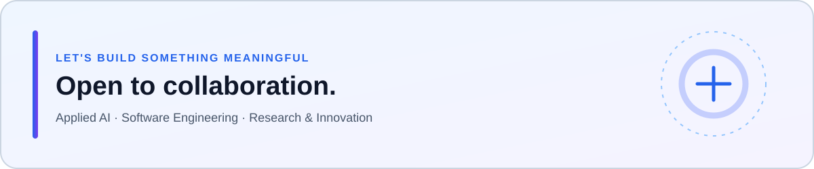

Open to **software engineering roles**, **AI/ML projects**, and technical collaboration.

[**CONNECT ON LINKEDIN ↗**](https://www.linkedin.com/in/lalith-teja-karnati-a59473270/) &nbsp; · &nbsp; [**SEND AN EMAIL ↗**](mailto:lalithteja713@gmail.com)

 

ENGINEERING INTELLIGENT SOLUTIONS · HYDERABAD, INDIA

