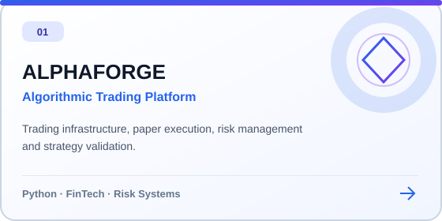
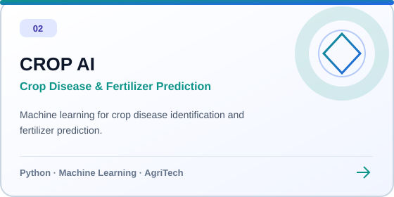
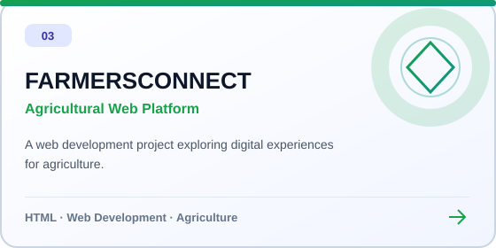
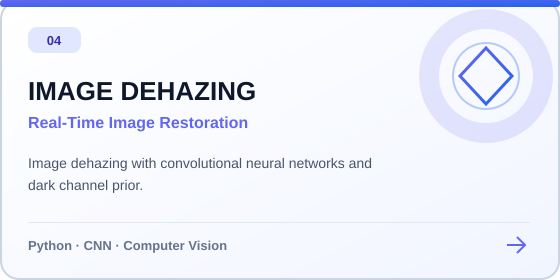
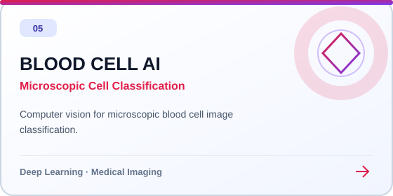
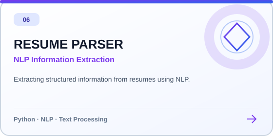
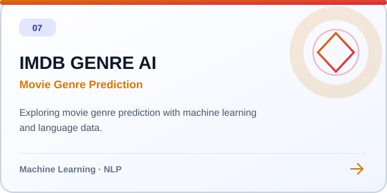
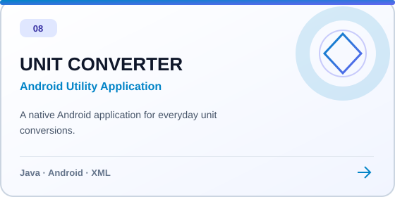
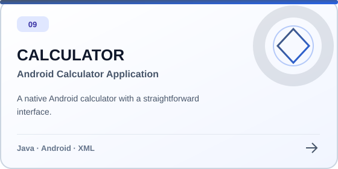

<!-- GitHub profile README · Lalith Teja Karnati -->

  
    
  <a href="https://www.linkedin.com/in/lalith-teja-karnati-a59473270/">LinkedIn</a> &nbsp;·&nbsp;
  <a href="mailto:lalithteja21@gmail.com">Email</a> &nbsp;·&nbsp;
  <a href="https://github.com/lalithtejakarnati?tab=repositories">Repositories</a>

 

## About Me

I'm **Lalith Teja Karnati**, a Computer Science Engineering graduate based in Hyderabad, India, focused on **software engineering and applied artificial intelligence**. My work spans machine learning, deep learning, computer vision, natural language processing, and application development.

I've worked on projects involving **CNN-based image restoration**, **medical image classification**, **information extraction**, **predictive machine learning**, and **algorithmic trading infrastructure**. I care about building practical, maintainable systems that turn technical ideas into useful software.

I'm interested in opportunities to collaborate on thoughtful engineering projects, applied AI, and intelligent software systems.

 

## Technical Expertise & Core Competencies

**Programming & Software Development**  
`Python` &nbsp; `Java` &nbsp; `SQL` &nbsp; `HTML` &nbsp; `CSS` &nbsp; `Git`

**Artificial Intelligence & Data Science**  
`Machine Learning` &nbsp; `Deep Learning` &nbsp; `Natural Language Processing` &nbsp; `Model Evaluation`

**Computer Vision & Frameworks**  
`OpenCV` &nbsp; `PyTorch` &nbsp; `TensorFlow` &nbsp; `CNNs` &nbsp; `Image Processing`

**Applications & Tools**  
`Android Development` &nbsp; `Jupyter Notebook` &nbsp; `GitHub` &nbsp; `SQLite`

 

## Selected Engineering Work

A collection of projects across **AI, computer vision, financial technology, agriculture, NLP, and Android development**. Every card opens its source repository.

<table width="100%">
<tr>
<td width="50%" valign="top"></td>
<td width="50%" valign="top"></td>
</tr>
<tr>
<td width="50%" valign="top"></td>
<td width="50%" valign="top"></td>
</tr>
<tr>
<td width="50%" valign="top"></td>
<td width="50%" valign="top"></td>
</tr>
<tr>
<td width="50%" valign="top"></td>
<td width="50%" valign="top"></td>
</tr>
<tr>
<td width="50%" valign="top"></td>
<td width="50%"></td>
</tr>
</table>

 

## Collaboration

  <a href="mailto:lalithteja21@gmail.com"><b>Start a conversation by email ↗</b></a>
  &nbsp;&nbsp;·&nbsp;&nbsp;
  <a href="https://www.linkedin.com/in/lalith-teja-karnati-a59473270/"><b>Connect on LinkedIn ↗</b></a>

 

  Designed for clarity, accessibility, and GitHub's native Markdown renderer.

